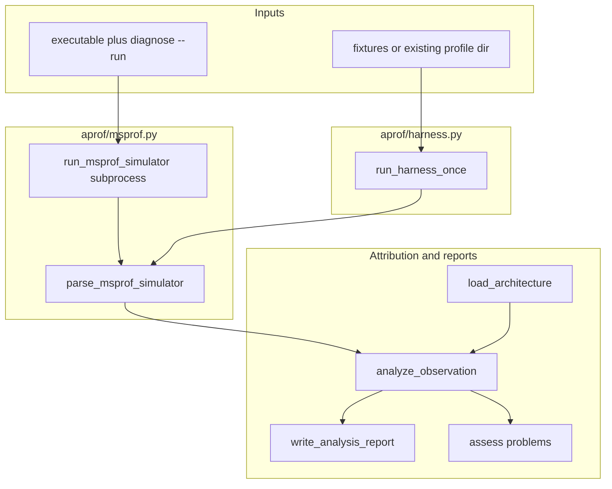

# AProf code layout and msprof / simulator data flow

This document describes how AProf is structured, how profiling artifacts move through the code, and how that relates to `msprof op simulator`, fixtures, and optional on-device msprof outputs.

## Is there a “virtual msprof” inside AProf?

No. AProf does not execute a fake `msprof` binary in Python. Data comes from exactly one of these:

1. **An offline directory** (any directory you copy that matches the expected layout): [`parse_msprof_simulator`](../src/aprof/profiling/msprof.py) reads `trace.json`, `*_code_exe.csv`, and related files from disk and builds an in-memory [`Observation`](../src/aprof/core/models.py).

2. **`diagnose --run`**: [`run_msprof_simulator`](../src/aprof/profiling/msprof.py) runs a real subprocess: `msprof op simulator ...` (CANN + simulator libraries required). The resulting output directory is then passed to the same parser as in (1).

The MVP is designed around consuming **`msprof op simulator`-style artifacts**. When CANN/`msprof` is missing, the probe and harness report missing prerequisites instead of pretending a profile was collected (see [`reports/poc_method_iteration/proof_of_concept.md`](../reports/poc_method_iteration/proof_of_concept.md)).

**If you profile on a real NPU with a different `msprof` subcommand**: the wrappers and environment probe in this repo target **`msprof op simulator`**, not a separate on-device collection path. If your on-device tree **happens** to contain a Chrome-trace-style `trace.json` (`traceEvents` with `ph=="X"`) and `*_code_exe.csv` files in discoverable locations, `parse_msprof_simulator` may partially work, but that is not the supported contract. The supported contract is **simulator-shaped** output.

---

## Layers (by responsibility)

| Layer | Main modules | Role |
|-------|----------------|------|
| CLI | [`src/aprof/cli/main.py`](../src/aprof/cli/main.py) | `analyze`, `diagnose`, `compare`, `probe-env`, `command`, `skills` |
| Collection + parsing | [`src/aprof/profiling/msprof.py`](../src/aprof/profiling/msprof.py) | Environment probe, build `msprof op simulator` command, subprocess run, `parse_msprof_simulator` |
| Harness | [`src/aprof/agents/profiling/harness.py`](../src/aprof/agents/profiling/harness.py) | Resolve profile directory, optionally run msprof, write environment / analysis / problems / `harness.json` |
| Architecture + attribution | [`src/aprof/metrics/architecture.py`](../src/aprof/metrics/architecture.py), [`src/aprof/agents/diagnosis/roofline.py`](../src/aprof/agents/diagnosis/roofline.py), [`src/aprof/agents/diagnosis/attribution.py`](../src/aprof/agents/diagnosis/attribution.py) | Load [`configs/architectures/ascend910b1.yaml`](../configs/architectures/ascend910b1.yaml), per-window roofline, diagnosis |
| Reports + problem surface | [`src/aprof/reports/analysis.py`](../src/aprof/reports/analysis.py), [`src/aprof/agents/profiling/model_client.py`](../src/aprof/agents/profiling/model_client.py) | `summary.*`, `problems.*`, etc. |
| Benchmarks | [`src/aprof/benchmarks/`](../src/aprof/benchmarks/) | Injected ops, reference ops, CANNBench adapter |

**`--source-root` (CANN / kernel source)**: the harness only runs [`_summarize_source_root`](../aprof/harness.py) (file counts, sample paths) for context passed to [`LocalHeuristicModelClient`](../aprof/model_client.py). It does **not** feed source into a static analyzer that drives profiling. The performance path is **trace + hotspot CSV + architecture YAML**.

---

## End-to-end data flow

### What `parse_msprof_simulator` does

1. [`_resolve_run_root`](../aprof/msprof.py): under the given root, prefer a layout with `trace.json` or `simulator/`, else pick the newest `OPPROF_*` directory (matches real tool layouts).

2. **Metadata**: merge `metadata.json` / `aprof_metadata.json` from the requested root and the resolved run root (`diagnose --run` writes `aprof_metadata.json`).

3. **Time windows**: read `trace.json`, take Chrome-trace complete events (`ph=="X"`), read `ts` / `dur` and `args` for component hints, map names through [`normalize_component`](../aprof/msprof.py) to labels such as `vector`, `mte2`.

4. **No trace file**: fall back to [`_windows_from_hotspots`](../aprof/msprof.py), which lays out synthetic sequential windows from hotspot `running_time_us` (degraded path when only CSVs exist).

5. **Hotspots**: `rglob("*_code_exe.csv")`, e.g. [`fixtures/msprof_simulator/vector_add_scalar_hotspot/simulator/core0.veccore0/core0.veccore0_code_exe.csv`](../fixtures/msprof_simulator/vector_add_scalar_hotspot/simulator/core0.veccore0/core0.veccore0_code_exe.csv).

The result is an [`Observation`](../aprof/models.py), then [`analyze_observation`](../aprof/attribution.py) (window utilization, aggregate vs time axis, bottleneck class, `next_profiling_requests`, etc.).

---

## What “msprof simulator” means in this repo

- **Tool meaning**: the CANN CLI path **`msprof op simulator`** (no physical card, but needs toolkit + simulator shared libraries).

- **Code meaning**: AProf treats the **directory layout and file formats** produced by that path as its input contract. [`fixtures/msprof_simulator`](../fixtures/msprof_simulator/) holds **hand- or script-built minimal trees** with the same shape so tests and `analyze` run without Linux/CANN.

So the common confusion “there is a virtual msprof” is better stated as: **the fixtures virtualize data layout, not the `msprof` program.**

---

## Mapping to your setup

- **CANN source + binary, Linux, simulator profiling**: use README `diagnose ... --run` or [`scripts/collect_msprof_sample.py`](../scripts/collect_msprof_sample.py); the raw directory then follows the same parse path as fixtures.

- **Only on-device msprof reports**: confirm you have **compatible** `trace.json` and `*_code_hotspot`-style `*_code_exe.csv` paths. If layout or columns differ, extend [`aprof/msprof.py`](../aprof/msprof.py) or normalize offline into the current contract; that module is the extension point for multiple msprof shapes.

---

## Related docs

- [`msprof_simulator_setup.md`](msprof_simulator_setup.md): environment and example commands.
- [`adding_msprof_benchmark.md`](adding_msprof_benchmark.md): benchmark capture workflow.
