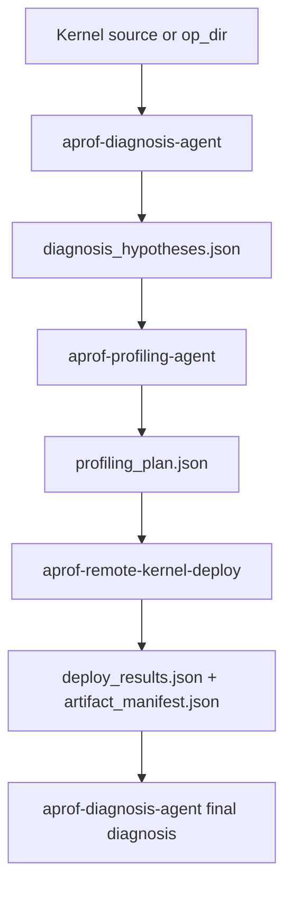

# AProf Performance Workflow

目标：输入 Ascend C kernel 源码，输出性能问题诊断和相关硬件数据支撑。

## 状态机

## Step 1：源码诊断

调用 `aprof-diagnosis-agent`：

- 输入：kernel 源码、源码路径或工程路径。
- 必读：`ascendc-aprof-diagnosis`、`source-hypothesis-routing.md`。
- 输出：`diagnosis_hypotheses.json`。

门禁：

- `hypotheses.length <= 3`。
- `metrics.length <= 3`。
- 每个 metric 有字段来源、公式或 trace 来源。

## Step 2：Metric 到采集计划

调用 `aprof-profiling-agent`：

- 输入：Step 1 的 `metrics[]` 和 `linked_hypotheses`。
- 必读：`metric-bundles.md`、`metric-to-msprof.md`、`report-parsing.md`。
- 输出：`profiling_plan.json`。

门禁：

- `profile_mode` 是 `sim`、`hw-msprof`、`hw-op` 之一。
- `remote_deploy_args.profile_mode` 与 `profile_mode` 一致。
- 每个 metric 在 `parser_plan[]` 中有解析来源。

## Step 3：远程执行与拉取 report

调用 `aprof-remote-kernel-deploy`：

- 输入：本地 `op_dir`、`profiling_plan.json`、`remote_deploy_args`。
- 执行：`remote_msprof_deploy.py --profiling-plan <profiling_plan.json>`。
- 输出：`deploy_results.json`、`artifact_manifest.json`、CSV/trace。

门禁：

- `deploy_results.json.has_artifacts == true`。
- 若传入 `profiling_plan.json`，`artifact_manifest.json.ready_for_diagnosis == true`。

## Step 4：最终证据归因

再次调用 `aprof-diagnosis-agent`：

- 输入：源码、`diagnosis_hypotheses.json`、`profiling_plan.json`、`artifact_manifest.json`、report 目录。
- 输出：`final_diagnosis.md`。

最终报告必须包含：

- 最可能问题和证据等级。
- 每个关键 metric 的值、公式、来源文件。
- 缺失数据和下一步采集建议。

## 只生成计划模式

如果用户未授权远程采集，workflow 在 Step 2 停止，并输出：

- `diagnosis_hypotheses.json`。
- `profiling_plan.json`。
- 需要用户补充的 `run_cmd`、`gen_data_cmd`、远程配置或 NPU 环境信息。
